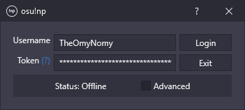

  

<h1 align="center">osu!np</h1>

  A now playing chat bot for osu! streamers!

  

## Usage

osu!np supports Windows 7 and above.

[Click here](https://github.com/TheOmyNomy/OsuNowPlaying/releases/latest/download/osu!np.zip) to download the latest
version. Extract the contents and run the **osu!np** application.

## Advanced

This section contains optional settings that allow you to change the channel osu!np listens to / responds in, the
request command, and the response format.

### Patterns

Patterns are only supported in the **Format** text field.

Patterns:

* `!artist!` - The beatmap / song artist (i.e. `xi`).
* `!title!` - The beatmap / song title (i.e. `Blue Zenith`).
* `!creator!` - The beatmap creator / mapper (i.e. `Asphyxia`).
* `!version!` - The beatmap version / difficulty (i.e. `FOUR DIMENSIONS`).
* `!sender!` - The command user's username (i.e. `TheOmyNomy`).
* `!id!` - The beatmap ID (i.e. `658127`).
* `!set-id!` - The beatmap set ID (i.e. `292301`).

Example:

* Format: `@!sender! !artist! - !title! (!creator!) [!version!] - https://osu.ppy.sh/beatmaps/!id!`
* Response: `@TheOmyNomy xi - Blue Zenith (Asphyxia) [FOUR DIMENSIONS] - https://osu.ppy.sh/beatmaps/658127`

## Licence

This software is licensed under the [GNU General Public Licence 3.0](LICENCE) licence.