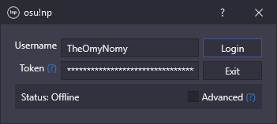

  

<h1 align="center">osu!np</h1>

  A now playing chat bot for osu! streamers!

## About

osu!np is a simple application that retrieves current beatmap information (artist, creator, etc.) from osu! and sends it
in the streamer's chat.

## Installation

osu!np supports Windows 7 and above.

[Click here](https://github.com/TheOmyNomy/OsuNowPlaying/releases/latest/download/osu!np.zip) to download the latest
version. Extract the contents and run the **osu!np** application.

## Usage

The simplest way to use osu!np is with your own Twitch account.

* Enter your username in the **Username** text field.
* Click the **(?)** link next to the **Token** label or [click here](https://twitchapps.com/tmi/) to open the **Twitch
  Chat OAuth Password Generator** website.
* Click the **Connect** button and then the **Authorise** button.
* Copy the token (including the `oauth:` at the start) and paste it into the **Token** text field.
* Click the **Login** button.

osu!np will now be listen for / respond to the command `!np` in your chat.

## Usage (Advanced)

Checking the **Advanced** check box reveals additional settings that allow you to change the channel osu!np listens to /
responds in, the request command, and the response format.

These settings are optional and will default to the text shown in grey if left empty.

* **Channel:** The channel osu!np will listen to / respond in.
* **Command:** The command osu!np will respond to.
* **Format:** The message osu!np will respond with. Supports patterns (see below).

### Patterns

Patterns are only supported in the **Format** text field.

Patterns:

* `!artist!` - The beatmap / song artist (i.e. `xi`).
* `!title!` - The beatmap / song title (i.e. `Blue Zenith`).
* `!creator!` - The beatmap creator / mapper (i.e. `Asphyxia`).
* `!version!` - The beatmap version / difficulty (i.e. `FOUR DIMENSIONS`).
* `!sender!` - The command user's username (i.e. `TheOmyNomy`).
* `!id!` - The beatmap ID (i.e. `658127`).
* `!set-id!` - The beatmap set ID (i.e. `292301`).

Example:

* Format: `@!sender! !artist! - !title! (!creator!) [!version!] - https://osu.ppy.sh/beatmaps/!id!`
* Response: `@TheOmyNomy xi - Blue Zenith (Asphyxia) [FOUR DIMENSIONS] - https://osu.ppy.sh/beatmaps/658127`

## Licence

This software is licensed under the [GNU General Public Licence 3.0](LICENCE) licence.